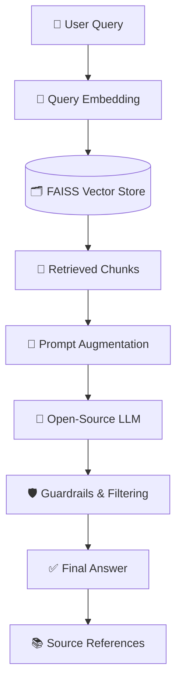

# 🚀 RAGnosis – Retrieval-Augmented Knowledge Assistant

<p align="center">
  <b>Hallucination-Free Document Question Answering</b><br>
  <i>Semantic search, grounded answers, and source attribution using open-source LLMs.</i>
</p>

<p align="center">
  <a href="#-features">✨ Features</a> |
  <a href="#-quickstart">⚡ Quickstart</a> |
  <a href="#-architecture">🛠 Architecture</a> |
  <a href="#-tech-stack">🧩 Tech Stack</a> |
  <a href="#-use-cases">🎯 Use Cases</a>
</p>

<p align="center">
  
  
  
  
</p>

---

## 📑 Table of Contents
- [About](#-about)
- [Features](#-features)
- [Quickstart](#-quickstart)
- [Architecture](#-architecture)
- [Tech Stack](#-tech-stack)
- [Use Cases](#-use-cases)
- [Project Structure](#-project-structure)
- [Author](#-author)
- [License](#-license)

---

## 🧐 About

**RAGnosis** is an end-to-end **Retrieval-Augmented Generation (RAG)** platform designed to answer user queries **strictly from a given set of documents**.

Unlike traditional LLM chatbots that rely on pre-trained knowledge and may hallucinate, RAGnosis:
- Retrieves **relevant document context**
- Injects it into the LLM prompt
- Generates **grounded, verifiable answers with source references**

The system is built entirely using **open-source models and frameworks**, making it suitable for **academic, enterprise, and on-premise use cases**.

---

## ✨ Features

### 📄 Document Intelligence
- Supports **PDF, TXT, and Markdown** documents
- Automatic document ingestion & preprocessing
- Intelligent text chunking with overlap

### 🔢 Semantic Search
- Dense vector embeddings using **Sentence Transformers**
- High-performance similarity search using **FAISS**
- Query-to-document semantic matching (not keyword-based)

### 🧠 Context-Aware Answering
- Retrieval-augmented prompt construction
- Deterministic answer generation (low temperature)
- Explicit *“answer only from context”* enforcement

### 🛡 Safety & Reliability
- Hallucination prevention guardrails
- Confidence thresholding
- Mandatory source attribution
- Graceful fallback when context is insufficient

### 🖥 User Interface
- Simple, clean **Streamlit UI**
- Real-time question answering
- Transparent source visibility

---

## ⚡ Quickstart

### 1️⃣ Clone the Repository
```bash
git clone https://github.com/Aayushhh07/RAGnosis.git
cd RAGnosis
```
### 2️⃣ Create Virtual Environment
```bash
python -m venv venv
venv\Scripts\activate 
```
### 3️⃣ Install Dependencies
```bash
pip install -r requirements.txt
```
### 4️⃣ Add Documents
```bash
documents/
```
### 5️⃣ Run the Application
```bash
streamlit run app.py
```

## 🛠 Architecture


## 🧩 Tech Stack

### **Core**
- **Python** – Primary programming language
- **LangChain** – RAG orchestration and chaining
- **Streamlit** – Interactive web UI

### **Embeddings & Vector Search**
- **Sentence Transformers** – Semantic text embeddings
- **FAISS** – High-performance vector similarity search

### **LLM Inference**
- **Mistral / Phi / Gemma** – Open-source large language models
- **Ollama** – Local LLM serving and inference

### **Document Processing**
- **PyPDF** – PDF parsing
- **Recursive Text Splitter** – Efficient document chunking

### **Safety & Guardrails**
- Custom prompt constraints
- Context-only answer enforcement
- Confidence thresholding & fallback responses

---

## 🎯 Use Cases

- **Academic Research** – Question answering over research papers and notes  
- **Enterprise Knowledge Base** – Internal document assistants for teams  
- **Education** – Course material and syllabus-based Q&A  
- **Legal & Compliance** – Source-verifiable and grounded responses  
- **On-Prem AI Systems** – Fully offline, open-source RAG deployment  

---

## 📂 Project Structure

```text
RAG/
├── app.py                 # Streamlit UI
├── rag_pipeline.py        # Core RAG pipeline
├── document_processor.py  # Document ingestion and chunking
├── embeddings.py          # Embedding generation
├── vector_store.py        # FAISS vector database
├── guardrails.py          # Safety controls and filtering
├── documents/             # Input documents
├── vector_store/          # Saved FAISS index
└── requirements.txt       # Project dependencies
```
## 👨‍💻 Author

**Aayush Vishwakarma**  
- 💼 UsefulBI Corporation  
- 📍 India  
- 🔗 GitHub: https://github.com/Aayushhh07  
- 🔗 LinkedIn: https://www.linkedin.com/in/aayush-vishwakarma-68a8a92a1  
- 📬 Email: aayushvishwakarma93@gmail.com  

---

## 📜 License

This project is licensed under the **MIT License**.  
You are free to use, modify, and distribute this project for academic, educational, and research purposes.


